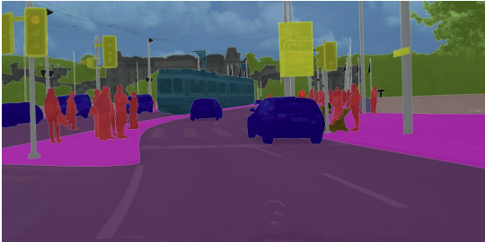

# Image Segmentation With U-Net
Built U-Net architecture for image segementation to predict a label for every single pixel in an image.

Semantic image segmentation allows you to predict a precise mask for each object in the image by labeling each pixel in the image with its corresponding class. The word “semantic” here refers to what's being shown, so for example the “Car” class is indicated below by the dark blue mask, and "Person" is indicated with a red mask:

<caption>
 <u><b>Figure</u></b>: Example of a segmented image   
</caption>

As you might imagine, region-specific labeling is a pretty crucial consideration for self-driving cars, which require a pixel-perfect understanding of their environment so they can change lanes and avoid other cars, or any number of traffic obstacles that can put peoples' lives in danger. 

## U-Net architecture 

<caption>
 <u><b> Figure </u></b>: U-Net Architecture  
</caption>

It consists of Encoder and Decoder :

The Encoder decreases height and width of input image while increasing no. of filters and Decoder upsamples height and width while decreasing no. of filters and cancatenating skip connections from Encoder.

The dataset can be downloaded from kaggle: https://www.kaggle.com/datasets/kumaresanmanickavelu/lyft-udacity-challenge?select=dataA
